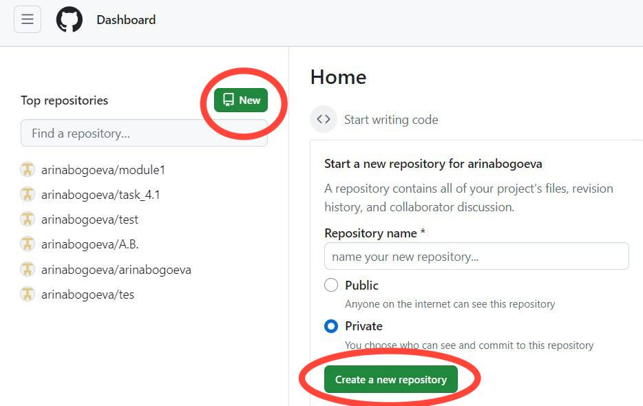
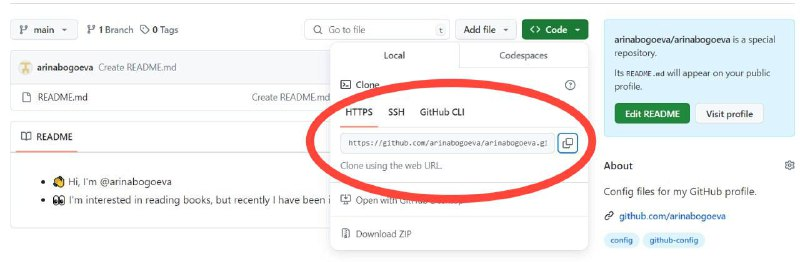

[На главную](./readme.md) 

[<назад ](./GitHub.md)  \  [ далее >](./git%20init.md)

### Создание проекта


Для создания нового репозиторя на GitHub используйте кнопку "new" на главной странице или на странице со списком репозиториев



После создания репозитория необходимо перенести его на на ваш компьютер. 

Для этого захотим в созданный репозиторий и нажимаем кнопку "code" в правом верхнем углу. Там будет указана ссылка на репозиторий, нам необходимо её скопировать



Далее переходим в GitBash, используем команду `git clone` и указывем скопированную ссылку

```bash
git clone https://github.com/arinabogoeva/arinabogoeva.git
```


*Готово! Локальный репозиторий создан, в нем можно работать!*

